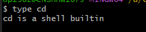

# 系统操作

## 一、 帮助命令

### 1.1 man

### 1.2 help

* shell 自带的命令称为内部命令，其他的是外部命令
* 内部命令使用help帮助
```bash
help cd
```
* 外部命令使用help帮助
```bash
ls --help
```

* 查看是内部还是外部命令

   type 
```bash
type cd
```


### 1.3 info
* info 帮助比help更详细，作为help的补充
```bash
info ls
```

## 二、文件管理命令

* pwd  显示当前的目录名称
* cd 更改当前的操作目录
* ls 查看当前目录下的文件
  * 常用参数
    * -l 长格式显示文件
    * -a 显示隐藏文件
    * -r 逆序显示
    * -t 按照时间顺序显示
    * -R 递归显示
    
